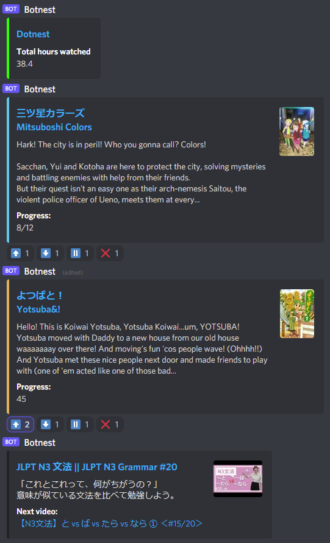

# botnest
This bot allows you to track and update your immersion progress on [Anilist](https://anilist.co/home) straight from your own discord server. Just click on a reaction under the message!



## Requirements
- [Python 3.8+](https://www.python.org/downloads/)
- [Pycord](https://github.com/Pycord-Development/pycord) (maintained fork of [discord.py](https://github.com/Rapptz/discord.py))
- [Discord bot account](https://docs.pycord.dev/en/master/discord.html)
- [Anilist API access](https://anilist.gitbook.io/anilist-apiv2-docs/overview/oauth/getting-started)

    -   create an API client on [this](https://anilist.co/settings/developer) page, set redirect url to `https://anilist.co/api/v2/oauth/pin`
    - run and follow instructions from `api_setup.py` to get your api access token, note that it will write to a file different from bot's own config

## Preparations
- [Download](https://github.com/dotnest/botnest/archive/refs/heads/main.zip) and unpack this repository
- Create a `config.json` file and paste the following inside
```json
{
    "discord_token": "your discord bot token here",
    "access_token": "your anilist access token here",
    "refresh_token": "your anilist refresh token here",
    "username": "your anilist username here",
    "channel_id": "your discord channel id here",
    "youtube_playlists": {}
}
```
- Put in your discord bot token, Anilist's access and refresh tokens and Anilist username
- Run the bot, type `!channel_id` in the channel where you want your tracking information to be
- Put that id in your config, restart the bot

## Available commands
- `!r` - resyncs with Anilist
- `!channel_id` - prints out current channel id
- to add a youtube playlist to track - just paste the url to a playlist (or to a video in a playlist) in the tracking channel (for now you'll have to `!r` for it to appear)